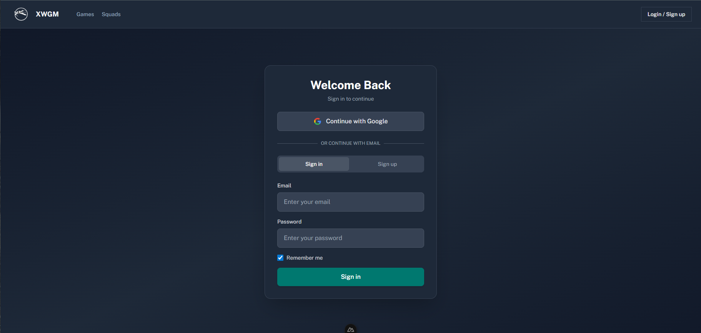
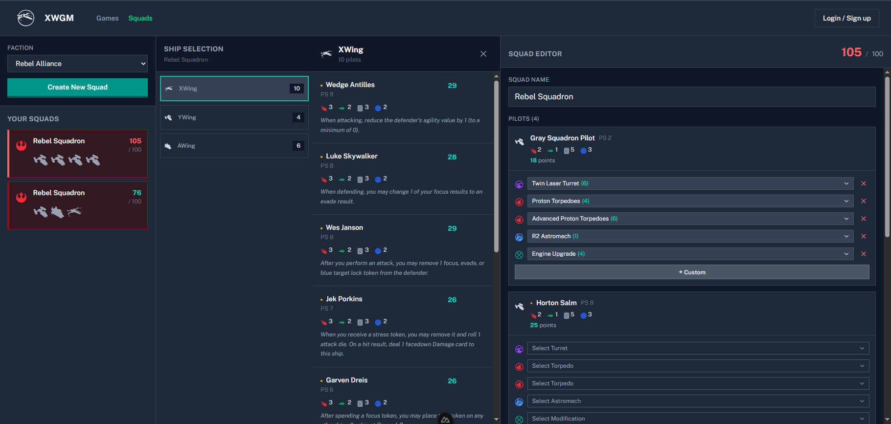
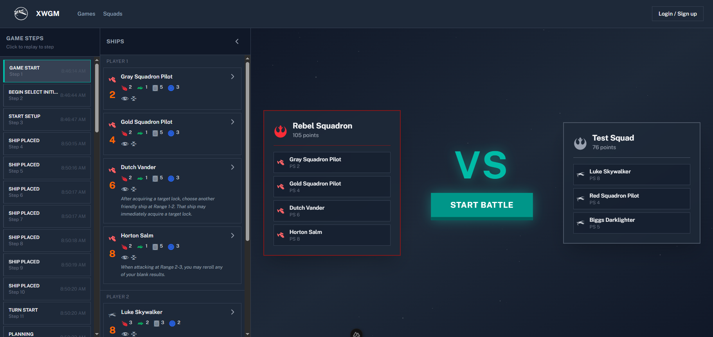

# X-Wing Game Runner

A state-heavy, interactive game runner for X-Wing Miniatures Game built with Nuxt 4, featuring multiplayer support, realtime sync, and complex game state management.

## Goal

Build a comprehensive game runner that manages lists, activation dials, damage tracking, and game phases with clear client/server boundaries, typed APIs, and optional realtime synchronization.

## Screenshots

### Login Screen



### Squad Builder



### Battle Screen



## Core Architecture

### Tech Stack

- **Nuxt 4** – Primary framework with clear client/server separation
- **Nitro Server** – Node runtime (not edge) for complex logic
- **Pinia** – Client-side state management
- **SSE (Server-Sent Events)** – Realtime sync via Nitro `createEventStream`
- **Drizzle** - ORM of choice
- **Postgres** – Migration-ready data storage
- **OIDC** – Authentication via Auth.js / sidebase or Nuxt OIDC module

### Why Nuxt?

- Clear separation between client and server code
- Type-safe API routes with full TypeScript support
- Nitro makes SSE trivial to implement
- Flexible deployment options
- Streamlined state management with Pinia

## App Routes

```
/squads                 – View game lists
  /new                 – Create new list
  /import              – Import list from URL/file
  /:id                 – View specific list

/games                 – Game management
  /new                 – Start new game
  /:id                 – Main game runner (state-heavy UI)
```

**Layouts:**

- `default.vue` – Main navigation, global context
- `game.vue` – Sticky header, left/right rails, phase workspace

## Game Flow (Finite State Machine)

The game progresses through explicit, server-validated state transitions:

```
Setup
  └─ Initiative (all ships lock in)

Planning
  └─ Dials (assign maneuvers)

Activation
  ├─ Reveal Dial
  ├─ Execute Maneuver
  ├─ Actions / Tokens
  ├─ Bombs
  └─ Collisions

Engagement
  ├─ Select Attack
  ├─ Roll Dice
  └─ Apply Damage

End Phase
  ├─ Cleanup
  └─ Upgrade Reminders
```

**Key Property:** All state transitions are explicit, immutable, and validated server-side before client updates.

## Realtime Sync (SSE)

### Pattern

```
Client → GET /api/games/:id/stream
         (establishes SSE connection)

Server tracks:
  gameId → userId → connections[]

Mutations happen via normal HTTP endpoints
  (POST /api/games/:id/activate, etc.)

Server pushes updates to:
  • All players
  • All except sender
  • Specific player(s)
```

### Why SSE?

- Simple request/response model
- Built-in auto-reconnect
- Perfect for turn-based updates
- Minimal client-side complexity
- Native browser support (no WebSocket library needed)

## Data Storage

### Development & Single-Instance

**SQLite**

- Simple file-based storage
- Zero setup required
- Easy backups
- Perfect for local development

### Production & Multi-Instance

**Postgres**

- Multiple app instances
- Row-level locking for concurrent updates
- Hosted DB options (AWS RDS, Heroku, etc.)
- Horizontal scaling

**Implementation:** DAL is abstracted so migration is painless.

## Authentication

- **OIDC** (OpenID Connect) provider
- **Cookie-based sessions**
- Enforced in:
  - Command endpoints (`/api/games/:id/activate`, etc.)
  - SSE connection handshake (`GET /api/games/:id/stream`)

## Project Structure

```
/app
  /pages            – Route components
  /components       – Reusable UI components
  /layouts          – Page layouts
  /assets/css       – Stylesheets
  app.vue           – Root component
  app.config.ts     – Runtime config

/server/routes      – Nitro API routes
/server/utils       – Server utilities
/server/middleware  – Auth, logging, etc.

nuxt.config.ts      – Nuxt configuration
tsconfig.json       – TypeScript config
package.json        – Dependencies
```

## 🚀 Quick Start

### Install Dependencies

```bash
pnpm install
```

### Development Server

Start the dev server on `http://localhost:3000`:

```bash
pnpm dev
```

### Production Build

Build for production:

```bash
pnpm build
```

Preview production build locally:

```bash
pnpm preview
```
